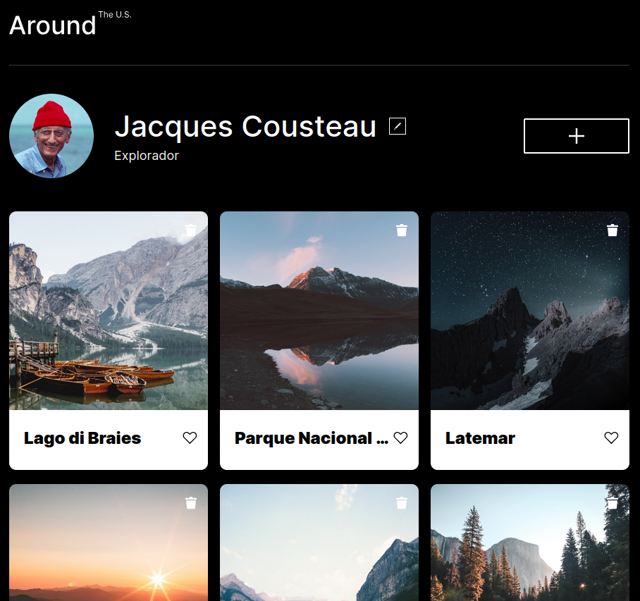

# Around The U.S.

> Uma galeria fotográfica interativa onde usuários podem compartilhar, visualizar e gerenciar seus lugares favoritos.

## Problema📋

Criar uma aplicação web responsiva capaz de gerenciar cartões de imagens dinamicamente, permitindo edição de perfil, criação de novos cartões, visualização ampliada de imagens e validação de formulários, mantendo uma arquitetura escalável e organizada.

## Solução🎯

O projeto foi desenvolvido utilizando JavaScript moderno com Programação Orientada a Objetos (POO), modularização via ES Modules e separação de responsabilidades através de componentes reutilizáveis.

A aplicação permite:

- Adicionar novos cartões
- Remover cartões
- Curtir e descurtir imagens
- Editar informações do perfil
- Visualizar imagens ampliadas
- Validar formulários em tempo real
- Fechar popups por overlay ou tecla ESC
- Navegação responsiva para diferentes dispositivos



## Arquitetura🏗️

O projeto segue uma arquitetura baseada em componentes.

```text
src
├── components
│   ├── Card.js
│   ├── FormValidator.js
│   ├── Popup.js
│   ├── PopupWithForm.js
│   ├── PopupWithImage.js
│   ├── Section.js
│   └── UserInfo.js
│
└── page
    ├── index.css
    └── index.js
```

### Principais Componentes

| Classe         | Responsabilidade                                 |
| -------------- | ------------------------------------------------ |
| Card           | Criação e gerenciamento dos cartões              |
| FormValidator  | Validação dos formulários                        |
| Popup          | Classe base para gerenciamento de modais         |
| PopupWithForm  | Popup especializado para formulários             |
| PopupWithImage | Popup especializado para visualização de imagens |
| Section        | Renderização dinâmica de coleções                |
| UserInfo       | Gerenciamento das informações do perfil          |

## Decisões Técnicas🧠

O projeto utiliza:

- HTML5 semântico
- CSS3
- JavaScript ES6+
- Programação Orientada a Objetos (POO)
- Encapsulamento
- Herança
- Polimorfismo
- ES Modules
- Metodologia BEM
- Normalize.css

A estrutura foi organizada para facilitar manutenção, reutilização de código e futuras integrações com APIs externas.

## Como Executar🚀

```bash
# Clone o repositório
git clone https://github.com/michael-ribeiro-fs/web_project_around_pt

# Entre na pasta do projeto
cd web_project_around_pt
```

Abra o projeto utilizando o Live Server do VS Code.

> Como o projeto utiliza módulos ES6, o arquivo index.html não deve ser aberto diretamente pelo navegador.

## Próximos Passos🔮

- Integração com API REST
- Persistência de dados no servidor
- Sistema de autenticação
- Gerenciamento de usuários
- Exclusão de cartões via backend
- Edição de avatar
- Melhorias de acessibilidade
- Otimizações de desempenho

## Licença📝

Projeto desenvolvido durante o programa de Desenvolvimento Web da TripleTen.
