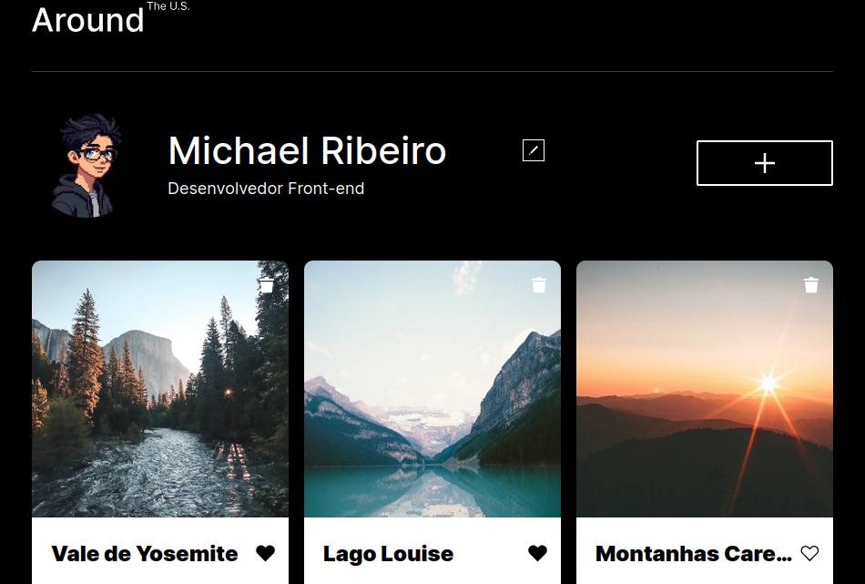

<h1 align="center">📸 Around The U.S.</h1>
<p align="center">
  Galeria fotográfica interativa para compartilhar, curtir e gerenciar lugares favoritos, com dados persistidos via API REST.

<p align="center">
  <a href="https://michael-ribeiro-fs.github.io/web_project_around_pt/src" target="_blank">
    
  </a>
</p>

## 🎬 Demonstração

<a href="https://youtu.be/G5R94ymmBZs" target="_blank">
  
</a>

> ▶️ Clique na imagem acima para assistir ao vídeo completo no YouTube.

## 🖼️ Screenshot



## 🛠️ Tecnologias

<p align="left">
  
  
  
  
  
  
</p>

## ✨ Funcionalidades

- 🖼️ Criação e exclusão de cartões (com confirmação)
- ❤️ Curtir / descurtir imagens
- 👤 Edição de perfil (nome, descrição e avatar)
- 🔍 Visualização ampliada de imagens
- ✅ Validação de formulários em tempo real
- ⌨️ Fechamento de popups via overlay ou tecla `ESC`
- 💾 Persistência de dados via API REST
- 📱 Layout 100% responsivo

## 🚀 Como executar

```bash
# Clone o repositório
git clone https://github.com/michael-ribeiro-fs/web_project_around_pt

# Acesse a pasta do projeto
cd web_project_around_pt
```

> ⚠️ O projeto utiliza ES Modules — abra com o **Live Server** do VS Code (não abra `index.html` diretamente no navegador).

## 🗺️ Roadmap

- [x] CRUD de cartões via API
- [x] Edição de perfil e avatar
- [x] Validação de formulários
- [ ] Autenticação (login/registro)
- [ ] Suporte a múltiplos usuários
- [ ] Testes automatizados
- [ ] Melhorias de acessibilidade
- [ ] Deploy em produção

## 📝 Licença

Software Próprio

## 👤 Autor

**Michael Ribeiro**
Projeto desenvolvido durante o programa de Desenvolvimento Web da **TripleTen**.
